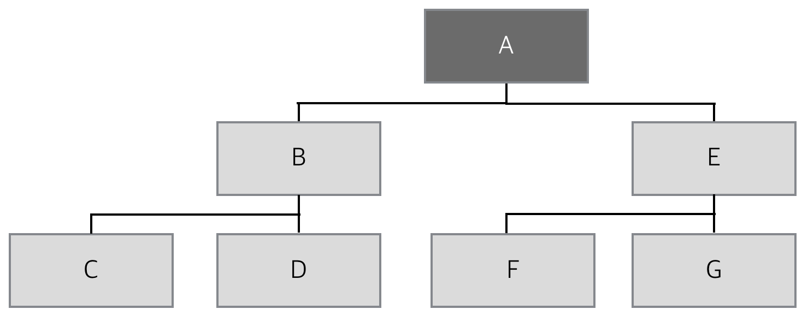

# Binary Tree

## 1. Binary Tree?
모든 노드가 최대 **2개**의 자식을 가질 수 있는 트리
주로 **수식 이진 트리(Expression Binary Tree)**와 **이진 탐색 트리(Binary Search Tree)**에 사용한다.

## 2. Binary Tree의 여러 형태
##### <!> Binary Tree의 자식 노드 갯수는 `{0,1,2}`로 한정된다.
##### <!> Binary Tree는 일반적으로 데이터를 담기 위한 자료구조가 아니라 컴파일러나 검색 등에 사용되는 특수 자료구조로, 높은 성능을 위해서 트리의 노드들을 가능한 한 '완전한' 모습으로 배치하는 것이 필수적이다.

* **포화 이진 트리(Full Binary Tree)**
  * `Leaf Node를 제외한 모든 노드가` 자식을 둘씩 가지고 있는 Binary Tree를 가리킨다. 
  * 모든 Leaf Node는 같은 깊이에 존재한다.

* **완전 이진 트리(Complete Binary Tree)**
  * 포화 이진 트리를 이루기 전 단계의 트리
  * Leaf Node들이 트리의 왼쪽부터 차곡차곡 채워져있다.

* **높이 균형 트리(Height Balanced Tree)**
  * Root Node를 기준으로 왼쪽 하위 트리와 오른쪽 하위 트리의 높이가 1 이상 차이나지 않는 이진 트리를 일컫는 말

* **완전 높이 균형 트리(Completely Height Balanced Tree)**
  * Root Node를 기준으로 왼쪽 하위 트리와 오른쪽 하위 트리의 높이가 같은 Binary Tree

## 3. Binary Tree Traversal(순회)
몇 가지 규칙에 근거해서 Binary Tree 내부를 돌아다니며 효율적인 방법으로 원하는 데이터에 접근할 수 있다.
Root Node를 언제 방문하느냐에 따라 3가지 순회로 나눌 수 있다.

#### 1. 전위 순회 - Preorder Traversal
전위 순회를 이용하면 Binary Tree를 중첩된 괄호로 표현할 수 있다.
Root부터 시작해서 방문하는 노드의 깊이가 깊어질 때마다 괄호를 한 겹씩 두르면 트리는 다음과 같이 표현될 수 있다.
> ( A ( B ( C, D ) ), ( E ( F, G ) ) )

1. Root Node부터 시작해서 아래로 내려오면서
2. 왼쪽 하위 트리를 방문하고, 방문이 끝나면
3. 오른쪽 하위 트리를 방문한다.

> A - B - C - D - E - F - G

#### 2. 중위 순회 - Inorder Traversal
트리는 하위 트리의 집합이고, 이러한 정의는 하위 트리가 또 다른 하위 트리로 나뉘어질 수 없을 때까지, 즉 하위 트리가 잎 노드일 때까지 반복해서 계속된다.
따라서 왼쪽 하위 트리부터 시작한다는 말은 트리에서 가장 왼쪽의 Leaf Node부터 시작한다는 뜻이고, 이 잎 노드에서부터 시작된 순회는 부모 노드를 방문한 후 자신의 형제 노드를 방문한다. 이렇게 **최소 단위의 하위 트리 순회가 끝나면 그 윗 단계 하위 트리에 대해 순회를 계속한다.**
1. 왼쪽 하위 트리부터 시작해서
2. Root를 거쳐
3. 오른쪽 하위 트리를 방문한다.

> C - B - D - A - F - E - G

수식 트리(Expression Tree)에 응용이 가능하며, 각 하위 트리의 시작과 끝에 `(`,`)`를 붙ㅇ주면 식을 완성할 수 있다.

#### 3. 후위 순회 - Postorder Traversal
1. 왼쪽 하위 트리부터 시작해서
2. 오른쪽 하위 트리를 거쳐
3. Root로 간다.

> C - D - B - F - G - E - A

중위 순회에서 완성했던 수식을 `후위 표기식`으로 표현할 수 있다.

## 4. Binary Tree 구현하기
SBT(Simple Binary Tree)
#### 1. 노드의 선언
```c
typedef char ElementType;

typedef struct tagSBTNode{
	struct tagSBTNode* Left;
    struct tagSBTNode* Right;
    ElementType Data;
}SBTNode;
```

#### 2. 노드의 생성과 소멸
`malloc()`을 이용해 자유 저장소에 SBTNode 구조체의 크기만큼 할당하고, 이렇게 할당한 메모리 공간을 NewNode 포인터에 저장한다.
```c
SBTNode* SBT_CreateNode(ElementType NewData){
	SBTNode* NewNode   = (SBTNode*)malloc(sizeof(SBTNode));
    NewNode->Left 	 = NULL;
    NewNode->RIght 	= NULL;
    NewNode->Data 	 = NewData;
    
    return NewNode;
}

void SBT_DestroyNode(SBTNode* Node){
	free(Node);
}
```

#### 3. 전위 순회를 이용한 Binary Tree 출력 구현
```c
void SBT_PreorderPrintTree(SBTNode* Node){
	if(Node == NULL){
    	return;
    }
    
    /* Root 노드 출력 */
    printf(" %c", Node->Data);
    
    /* 왼쪽 하위 트리 출력 */
    SBT_PreorderPrintTree(Node->Left);
    
    /* 오른쪽 하위 트리 출력 */
    SBT_PreorderPrintTree(Node->Right);
}
```

#### 4. 중위 순회를 이용한 Binary Tree 출력 구현
```c
void SBT_InorderPrintTree(SBTNode* Node){
	if(Node == NULL){
    	return;
    }
    
    /* 왼쪽 하위 트리 출력 */
    SBT_InorderPrintTree(Node->Left);
    
    /* Root 노드 출력 */
    printf(" %c", Node->Data);
    
    /* 오른쪽 하위 트리 출력 */
    SBT_InorderPrintTree(Node->Right);
}
```

#### 5. 후위 순회를 이용한 Binary Tree 출력 구현
```c
void SBT_PostorderPrintTree(SBTNode* Node){
	if(Node == NULL){
    	return;
    }
    
    /* 왼쪽 하위 트리 출력 */
    SBT_PostorderPrintTree(Node->Left);
    
    /* 오른쪽 하위 트리 출력 */
    SBT_PostorderPrintTree(Node->Right);
    
    /* Root 노드 출력 */
    printf(" %c", Node->Data);
}
```

#### 6. 후위 순회를 응용하여 트리 소멸 함수 구현
Tree를 파괴할 때는 반드시 잎 노드부터 자유 저장소에서 제거해야 한다. 따라서 후위 순회를 이용하면 Binary Tree를 문제 없이 소멸시킬 수 있다.
```c
void ET_DestroyTree(ETNode* Root){
	if(Root == NULL){
    	return;
    }
    
    /* 왼쪽 하위 트리 소멸 */
    ET_DestroyTree(Root->Left);
    
    /* 오른쪽 하위 트리 소멸 */
    ET_DestroyTree(Root->Right);
    
    /* Root 노드 소멸 */
    ET_DestroyNode(Root);
}
```