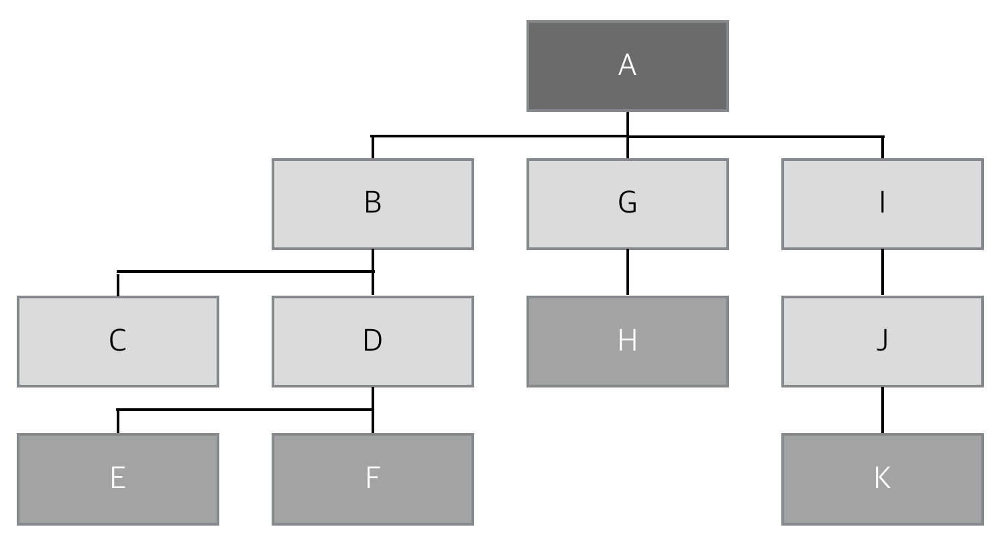
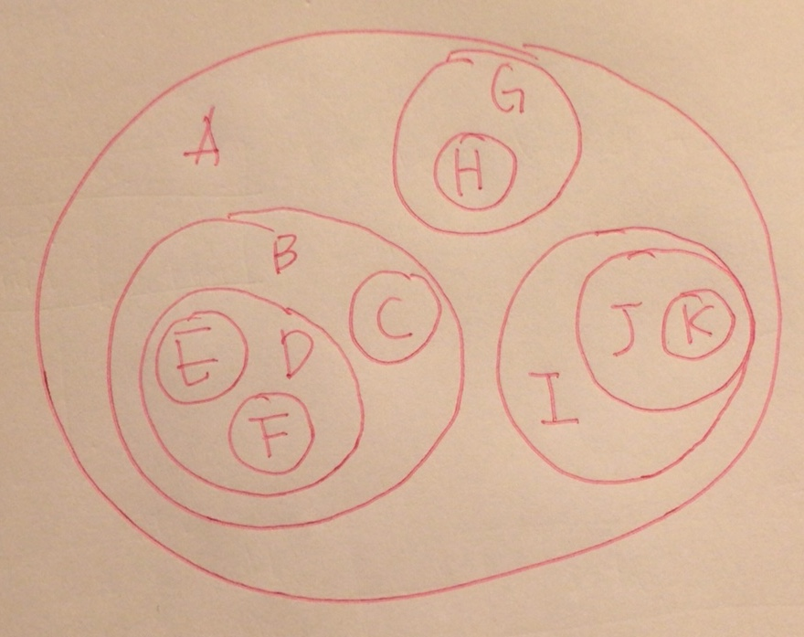
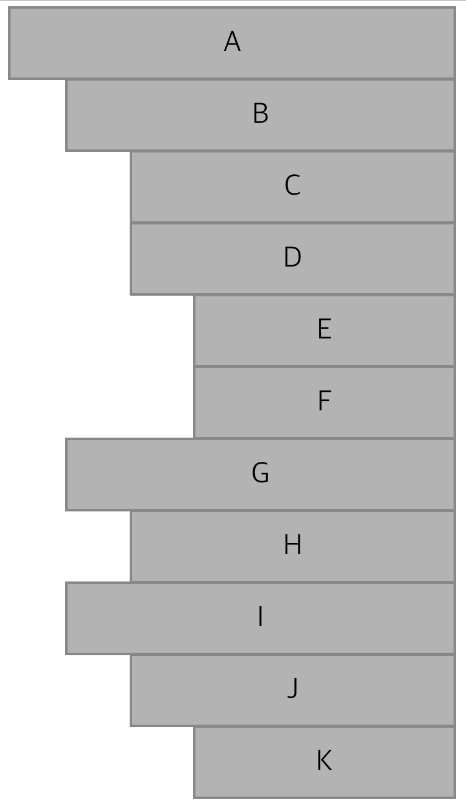

# Tree

## 1. Tree의 활용도
* 운영체제의 파일 시스템
* DOM ( Document Object Model )
* 검색엔진
* 데이터 베이스

## 2. Tree의 구조

다음 세가지 종류의 노드는 똑같은 노드이지만 위치에 따라 다르게 명명된다.
#### 1. Root - 뿌리
Tree 내의 최상위 노드 (A)
#### 2. Branch - 가지
Root 노드와 Leaf 노드 사이의 모든 노드 (B, G, I, C, D, J)
#### 3. Leaf - 잎
Tree 내의 최하위 노드들, 단말(Terminal)노드라고 부르기도 한다. (E, F, H, K)

## 3. Tree의 구성 요소

#### 1. 부모:자식관계 - Parent:Children
B는 C와 D의 부모이다.

#### 2. 형제관계 - Sibling
B와 G,I는 서로 형제이며 C와 D도 서로 형제이다.

#### 3. 경로 - Path
한 노드에서부터 다른 한 노드까지 이르는 길 사이에 놓여있는 노드들의 순서
> B에서 F까지의 경로는 B-D-F이다.

#### 4. 길이 - Length
출발 노드에서 목적지 노드까지 거쳐야 하는 노드의 개수
> B에서 F까지 경로의 길이는 2이다.

#### 5. 깊이 - Depth
루트 노드에서 해당 노드까지의 경로의 길이
> D의 깊이는 2이다.

#### 6. 레벨 - Level
깊이가 같은 노드의 집합
> 레벨 2 노드들 : C D H J

#### 7. 높이 - Height
**가장 깊은 곳**에 있는 잎 노드까지의 깊이
> 잎 노드들의 깊이인 3이 이 트리의 높이가 된다.

#### 8. 차수 - Degree
* 노드의 차수 : 노드의 자식 노드 개수
* 트리의 차수 : 트리 내에 있는 노드들 가운데 자식 노드가 가장 많은 노드의 차수

> A노드의 차수는 3이며, 자식 노드가 제일 많으므로 이 트리의 차수는 3이된다.

## 4. Tree 표현하기
이 방법들은 GUI로 트리를 표현할 때 자주 채택된다.
#### 1. 중첩된 괄호(Nested Parenthesis) 표현법
> (A(B(C)(D(E)(F)))(G(H))(I(J(K))))

#### 2. 중첩된 집합(Nested Set) 표현법

Tree가 하위 Tree의 집합이라는 관계를 잘 표현할 수 있다.

#### 3. 들여쓰기(Indentation)


## 5. Node 표현하기
#### 1. N-Link
노드의 차수가 N이라면 노드가 N개의 링크를 가지고 있어서 이 링크들이 각각 자식 노드를 가리키도록 노드를 구성하는 방법이다.
차수가 노드마다 달라지는 트리에는 적용하기가 어렵고, 동적 메모리를 할당하여 가변 배열을 만들거나 링크드 리스트를 사용하면 이 문제를 해결할 수 있지만 트리가 매우 복잡해진다.
#### 2. 왼쪽자식-오른쪽형제(Left Child-Right Sibling)
Node 내에 두개의 포인터를 가지게 된다. 한개는 자식노드를 가리키고 나머지 하나는 형제노드를 가리킨다.

## 6. Tree 구현하기
왼쪽자식-오른쪽형제(Left Child-Right Sibling)방식으로 구현한다.
#### 1. Node의 선언
구조체는 왼쪽자식과 오른쪽형제노드를 가리키는 두개의 포인터와 데이터를 담는 Data 필드로 이루어져있다.
```c
typedef char ElementType;

typedef struct tagLCRSNode{
    struct tagLCRSNode* LeftChild;
    struct tagLCRSNode* RightSibling;
    
    ElementType Data;
}LCRSNode;
```

#### 2. Node의 생성과 소멸
`malloc()`을 이용하여 자유저장소에 `LCRSNode` 구조체의 크기만큼을 할당하고 매개변수 `NewData`를 `Data`에 저장한 뒤, 그 주소를 반환한다.
```c
LCRSNode* LCRS_CreateNode(ElementType NewData){
    LCRSNode* NewNode = (LCRSNode*)malloc(sizeof(LCRSNode));
    NewNode->LeftChild	= NULL;
    NewNode->RightSibling = NULL;
    NewNode->Data = NewData;
    
    return NewNode;
}

void LCRS_DestroyNode(LCRSNode* Node){
    free(Node);
}
```

#### 3. Child Node연결하기
`LCRS_AddChildNode()`는 부모 노드와 자식 노드를 매개 변수로 받는다.
먼저 Parent에게 자식 노드가 있는지를 검사한 후 **NULL**인경우 `LeftChild`에 추가하고 이미 존재하는 경우에는 자식노드의 `RightSibling`에 대입한다.
```c
void LCRS_AddChildNode(LCRSNode* Parent, LCRSNode *Child){
    if(Parent->LeftChild == NULL){
    	Parent->LeftChild = Child;
    }
    else{
    	LCRSNode* TempNode = Parent->LeftChild;
        while(TempNode->RightSibling != NULL){
            TempNode = TempNode->RightSibling;
        }
        TempNode->RightSibling = Child;
    }
}
```

#### 4. Tree 출력하기
들여쓰기로 출력하는 방법을 구현한다.
```c
void LCRS_PrintTree(LCRSNode* Node, int Depth){
    int i=0;
    
    /* 깊이만큼 들여쓰기를 한다. */
    for(i=0; i<Depth; i++){
    	printf(" ");
    }
    
    /* Node에 담긴 데이터를 출력한다. */
    printf("%c\n",Node->Data);
    
    if(Node->LeftChild != NULL){
    	LCRS_PrintTree(Node->LeftChild, Depth+1);
    }
    
    if(Node->RightSibling != NULL){
    	LCRS_PrintTree(Node->RightSibling, Depth);
    }
}
```
