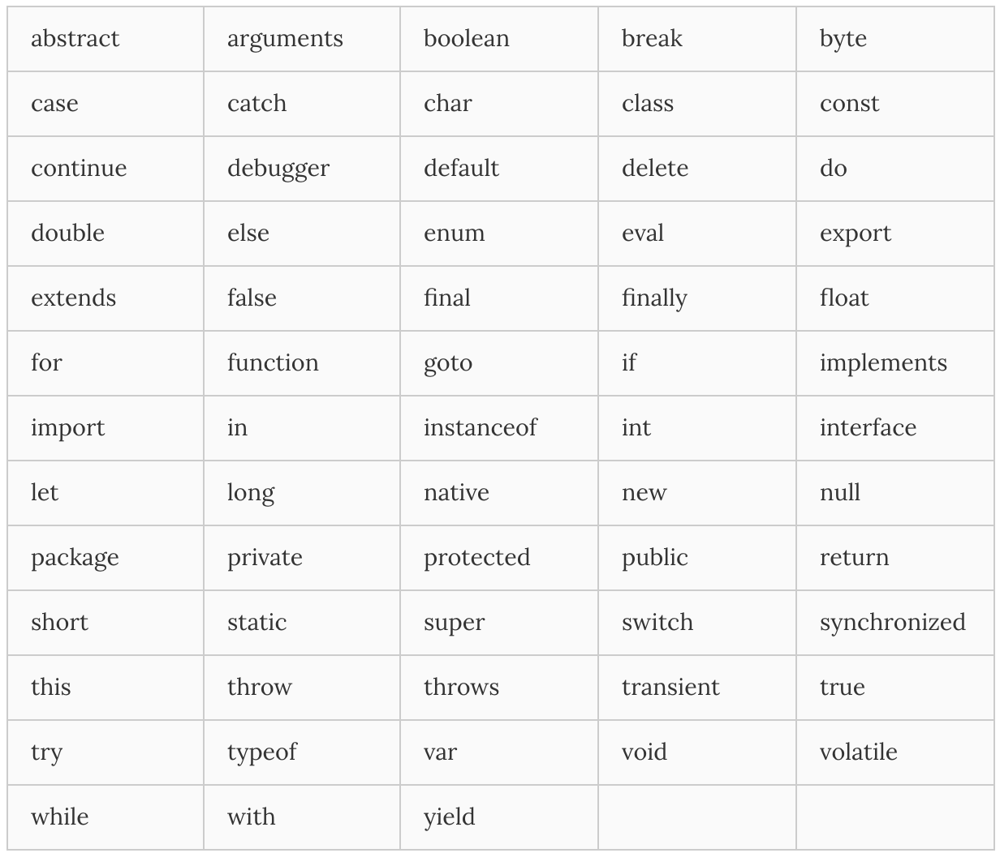

# Javascript의 기본 요소들

## 1. javascript로 할 수 있는것들
* HTML / CSS 와 함께 웹을 구성하는 요소 중 하나, 웹브라우저에서 동작하는 유일한 **언어**
* 멀티-패러다임 언어로, 명령형(imperative), 함수형(functional), 프로토타입기반 (prototype-based) 객체지향형 언어이다.
* >cf> 클래스는 없지만 프로토타입 객체지향 방식의 객체지향 언어이다.
* C-family language로 C와 Java에서 많은 문법을 차용했으며, intepreter language이기 때문에 compile이 필요없다.

## 2. Basic Syntax

#### 1. `<script>`의 위치
* `<body>`요소의 가장 아래에 스크립트를 위치시키는 것은 HTML요소들이 스크립트 로딩 지연으로 인해 렌더링에 지장받는 일이 발생하지 않아 페이지 로딩 시간이 단축된다.
```html
<!DOCTYPE html>
<html>
<body>
  <h1 id="demo">My Web Page</h1>
  <button type="button" onclick="myFunction()">Click me</button>
  <script src="extern.js"></script>
</body>
</html>
```

#### 2. 구문(Statement)의 구성요소
###### 구문은 대개 위에서 아래로 실행되며, Control Flow가 가능하며 함수 호출로 변경될 수 있다.
###### 블록 유효범위(Block-level scope)를 생성하지 않으며 함수단위의 유효범위(Functional-level scope)만이 생성된다.

* 값(Values)
 자바스크립트는 7가지 데이터 타입을 제공한다.
| 분류 | 요소 |
|:--------:|:--------:|
| 기본자료형(primitive data type) | Boolean<br>null<br>undefined<br>Number<br>String<br>Symbol(New in ECMAScript 6) |
| Object | . |

* 변수(Variable)
 한번쓰고 버리는 값이 아닌 값을 유지할 필요가 있는 경우 변수를 사용한다.
```javascript
var x;		//변수의 선언과 초기화
x = 6;		//정수값의 할당
```

* 연산자(Operators)

* 표현식(Expressions) : value, variable, operator의 조합, 하나의 값으로 평가될 수 있다.

* 주석(Comments)
```javascript
//한줄주석
/*
	여러줄주석
*/
```

* Keywords : 수행되어져야 할 동작을 규정한것

